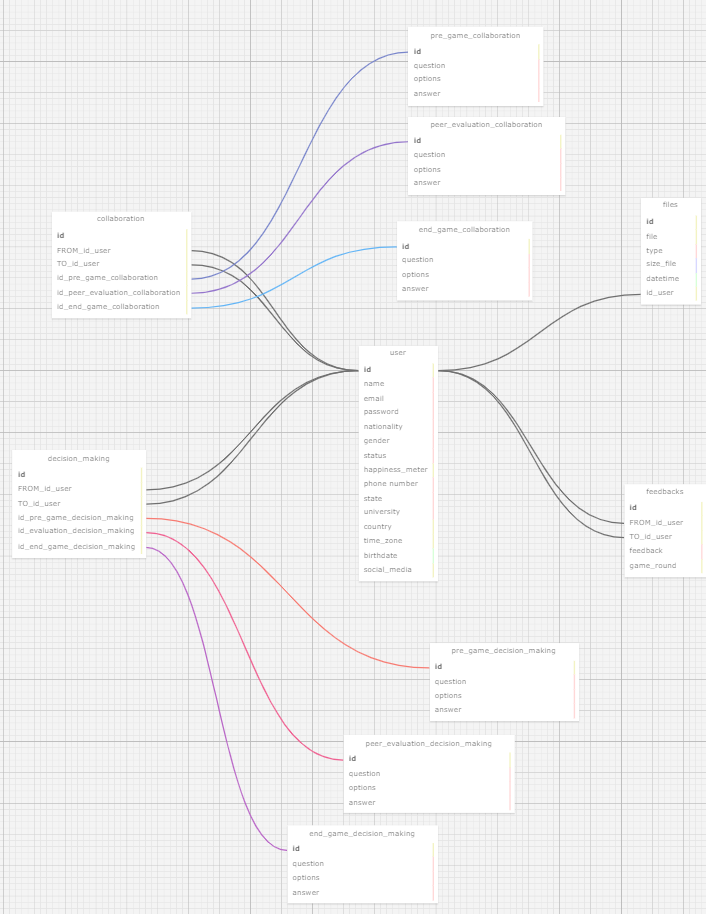

<div align="center">
<sup><a name="f1"></a>Figura 1 - Modelo Relacional
<br>

<br>
<sub>Fonte: Elaborado pelo autor (2024).
</div>


- Nome do Projeto: TechFlex
- Descrição: Modelagem doo banco de dados utilizado no projeto para a faculdade ZUYD.
- Ferramenta de modelagem: https://sql.toad.cz

<br>

# Documentação da modelagem do banco de dados

## Visão Geral
A modelagem relacional é uma modelo utilizado para organizar dados em um banco de dados usando tabelas, que são formados por colunas e linhas. Cada tabela contém dados específicos e possui uma chave primária (id) que identifica de forma única cada linha. As chaves estrangeiras são utilizadas para estabelecer relações entre tabelas, garantindo versatilidade. Este método permite realizar consultas complexas e é fundamental para a estruturação eficiente de bases de dados em sistemas de gerenciamento como MySQL e PostgreSQL.

<br>

## Características

### Entidades e Atributos

#### User

Descrição: Armazena dados de usuários, incluindo informações pessoais e de login.
Atributos: id, name, email, password, nationality, gender, status, happiness_meter, phone_number, state, university, time_zone, birthdate, social_media.

#### Decision Making

Descrição: Inclui dados sobre avaliações relacionadas à tomada de decisões.
Atributos: id, FROM_id_user, TO_id_user, id_pre_game_decision_making, id_peer_evaluation_decision_making, id_end_game_decision_making.

#### Pre Game Decision Making

Descrição: Avaliação de decision making realizada antes do início de um evento ou jogo.
Atributos: id, question, options, answer.

#### Peer Evaluation Decision Making

Descrição: Avaliação de decision making entre os integrantes.
Atributos: id, question, options, answer.

#### End Game Decision Making

Descrição: Avaliação de decision making realizada no final de um evento ou jogo.
Atributos: id, question, options, answer.

#### Collaboration

Descrição: Contém dados sobre avaliações de colaboração entre usuários.
Atributos: id, FROM_id_user, TO_id_user, id_pre_game_collaboration, id_peer_evaluation_collaboration, id_end_game_collaboration.

#### Pre Game Collaboration

Descrição: Avaliação de colaboração realizada antes do início de um evento ou jogo.
Atributos: id, question, options, answer.

#### Peer Evaluation Collaboration

Descrição: Avaliação de colaboração entre os integrantes.
Atributos: id, question, options, answer.

#### End Game Collaboration

Descrição: Avaliação de colaboração realizada no final de um evento ou jogo.
Atributos: id, question, options, answer.

#### Feedbacks

Descrição: Armazena feedbacks dados pelos usuários após interações ou avaliações.
Atributos: id, FROM_id_user, TO_id_user, feedback, feedback_type, game_round.

#### Files

Descrição: Registra detalhes dos arquivos carregados pelos usuários, incluindo tipo e data de upload.
Atributos: id, file, type, size_file, datetime, id_user.

<br>

### Relacionamentos e Cardinalidade

#### User e Decision Making:

Relação: A tabela Decision Making se relaciona com User através de FROM_id_user e TO_id_user, indicando quem realiza e quem recebe a avaliação.

Cardinalidade: 1:N (um usuário pode realizar ou ser alvo de várias avaliações de tomada de decisão).

#### User e Collaboration:

Relação: Semelhante à Decision Making, Collaboration se relaciona com User através de FROM_id_user e TO_id_user.

Cardinalidade: 1:N (um usuário pode realizar ou ser alvo de várias avaliações de colaboração).

#### User e Feedbacks:

Relação: A tabela Feedbacks se relaciona com User através de FROM_id_user e TO_id_user, indicando quem dá e quem recebe o feedback.

Cardinalidade: 1:N (um usuário pode dar ou receber vários feedbacks).

#### User e Files

Relação: A tabela Files se relaciona com USER através de user_id, indicando quem carregou os arquivos.

Cardinalidade: 1:N (um usuário pode carregar múltiplos arquivos, mas cada arquivo é carregado por um único usuário).

<br>

## Conclusão
Usar a modelagem relacional é como organizar um armário com várias gavetas etiquetadas: cada uma guarda itens específicos, e você sabe exatamente onde encontrar o que precisa. Esse método nos ajuda a estabelecer relações claras entre diferentes tipos de informações, como quais usuários carregaram quais arquivos ou quem deu feedback a quem. Isso torna mais fácil manter tudo em ordem e acessível e também garante que o sistema possa crescer e se adaptar sem perder eficiência ou criar confusão. De forma resumida, é uma maneira inteligente e estruturada de manter os dados organizados e prontos para o que precisarmos fazer com eles.

<br>

## Arquivos

### .xml

```xml
<?xml version="1.0" encoding="utf-8" ?>
<!-- SQL XML created by WWW SQL Designer, https://github.com/ondras/wwwsqldesigner/ -->
<!-- Active URL: https://sql.toad.cz/ -->
<sql>
<datatypes db="mysql">
	<group label="Numeric" color="rgb(238,238,170)">
		<type label="Integer" length="0" sql="INTEGER" quote=""/>
	 	<type label="TINYINT" length="0" sql="TINYINT" quote=""/>
	 	<type label="SMALLINT" length="0" sql="SMALLINT" quote=""/>
	 	<type label="MEDIUMINT" length="0" sql="MEDIUMINT" quote=""/>
	 	<type label="INT" length="0" sql="INT" quote=""/>
		<type label="BIGINT" length="0" sql="BIGINT" quote=""/>
		<type label="Decimal" length="1" sql="DECIMAL" re="DEC" quote=""/>
		<type label="Single precision" length="0" sql="FLOAT" quote=""/>
		<type label="Double precision" length="0" sql="DOUBLE" re="DOUBLE" quote=""/>
	</group>

	<group label="Character" color="rgb(255,200,200)">
		<type label="Char" length="1" sql="CHAR" quote="'"/>
		<type label="Varchar" length="1" sql="VARCHAR" quote="'"/>
		<type label="Text" length="0" sql="MEDIUMTEXT" re="TEXT" quote="'"/>
		<type label="Binary" length="1" sql="BINARY" quote="'"/>
		<type label="Varbinary" length="1" sql="VARBINARY" quote="'"/>
		<type label="BLOB" length="0" sql="BLOB" re="BLOB" quote="'"/>
	</group>

	<group label="Date &amp; Time" color="rgb(200,255,200)">
		<type label="Date" length="0" sql="DATE" quote="'"/>
		<type label="Time" length="0" sql="TIME" quote="'"/>
		<type label="Datetime" length="0" sql="DATETIME" quote="'"/>
		<type label="Year" length="0" sql="YEAR" quote=""/>
		<type label="Timestamp" length="0" sql="TIMESTAMP" quote="'"/>
	</group>
	
	<group label="Miscellaneous" color="rgb(200,200,255)">
		<type label="ENUM" length="1" sql="ENUM" quote=""/>
		<type label="SET" length="1" sql="SET" quote=""/>
		<type label="Bit" length="0" sql="bit" quote=""/>
	</group>
</datatypes><table x="1674" y="1459" name="user">
<row name="id" null="1" autoincrement="1">
<datatype>INTEGER</datatype>
<default>NULL</default></row>
<row name="name" null="1" autoincrement="0">
<datatype>CHAR</datatype>
<default>NULL</default></row>
<row name="email" null="1" autoincrement="0">
<datatype>CHAR</datatype>
<default>NULL</default></row>
<row name="password" null="1" autoincrement="0">
<datatype>CHAR</datatype>
<default>NULL</default></row>
<row name="nationality" null="1" autoincrement="0">
<datatype>CHAR</datatype>
<default>NULL</default></row>
<row name="gender" null="1" autoincrement="0">
<datatype>CHAR</datatype>
<default>NULL</default></row>
<row name="status" null="1" autoincrement="0">
<datatype>CHAR</datatype>
<default>NULL</default></row>
<row name="happiness_meter" null="1" autoincrement="0">
<datatype>INTEGER</datatype>
<default>NULL</default></row>
<row name="phone_number" null="1" autoincrement="0">
<datatype>CHAR</datatype>
<default>NULL</default></row>
<row name="state" null="1" autoincrement="0">
<datatype>CHAR</datatype>
<default>NULL</default></row>
<row name="university" null="1" autoincrement="0">
<datatype>CHAR</datatype>
<default>NULL</default></row>
<row name="country" null="1" autoincrement="0">
<datatype>INTEGER</datatype>
<default>NULL</default></row>
<row name="time_zone" null="1" autoincrement="0">
<datatype>INTEGER</datatype>
<default>NULL</default></row>
<row name="birthdate" null="1" autoincrement="0">
<datatype>DATE</datatype>
<default>NULL</default></row>
<row name="social_media" null="1" autoincrement="0">
<datatype>INTEGER</datatype>
<default>NULL</default></row>
<key type="PRIMARY" name="">
<part>id</part>
</key>
</table>
<table x="2131" y="1220" name="files">
<row name="id" null="1" autoincrement="1">
<datatype>INTEGER</datatype>
<default>NULL</default></row>
<row name="file" null="1" autoincrement="0">
<datatype>INTEGER</datatype>
<default>NULL</default></row>
<row name="type" null="1" autoincrement="0">
<datatype>CHAR</datatype>
<default>NULL</default></row>
<row name="size_file" null="1" autoincrement="0">
<datatype>bit</datatype>
<default>NULL</default></row>
<row name="datetime" null="1" autoincrement="0">
<datatype>DATETIME</datatype>
<default>NULL</default></row>
<row name="id_user" null="1" autoincrement="0">
<datatype>INTEGER</datatype>
<default>NULL</default><relation table="user" row="id" />
</row>
<key type="PRIMARY" name="">
<part>id</part>
</key>
</table>
<table x="1115" y="1629" name="decision_making">
<row name="id" null="1" autoincrement="1">
<datatype>INTEGER</datatype>
<default>NULL</default></row>
<row name="FROM_id_user" null="1" autoincrement="0">
<datatype>INTEGER</datatype>
<default>NULL</default><relation table="user" row="id" />
</row>
<row name="TO_id_user" null="1" autoincrement="0">
<datatype>INTEGER</datatype>
<default>NULL</default><relation table="user" row="id" />
</row>
<row name="id_pre_game_decision_making" null="1" autoincrement="0">
<datatype>INTEGER</datatype>
<default>NULL</default><relation table="pre_game_decision_making" row="id" />
</row>
<row name="id_evaluation_decision_making" null="1" autoincrement="0">
<datatype>INTEGER</datatype>
<default>NULL</default><relation table="peer_evaluation_decision_making" row="id" />
</row>
<row name="id_end_game_decision_making" null="1" autoincrement="0">
<datatype>INTEGER</datatype>
<default>NULL</default><relation table="end_game_decision_making" row="id" />
</row>
<key type="PRIMARY" name="">
<part>id</part>
</key>
</table>
<table x="1178" y="1242" name="collaboration">
<row name="id" null="1" autoincrement="1">
<datatype>INTEGER</datatype>
<default>NULL</default></row>
<row name="FROM_id_user" null="1" autoincrement="0">
<datatype>INTEGER</datatype>
<default>NULL</default><relation table="user" row="id" />
</row>
<row name="TO_id_user" null="1" autoincrement="0">
<datatype>INTEGER</datatype>
<default>NULL</default><relation table="user" row="id" />
</row>
<row name="id_pre_game_collaboration" null="1" autoincrement="0">
<datatype>INTEGER</datatype>
<default>NULL</default><relation table="pre_game_collaboration" row="id" />
</row>
<row name="id_peer_evaluation_collaboration" null="1" autoincrement="0">
<datatype>INTEGER</datatype>
<default>NULL</default><relation table="peer_evaluation_collaboration" row="id" />
</row>
<row name="id_end_game_collaboration" null="1" autoincrement="0">
<datatype>INTEGER</datatype>
<default>NULL</default><relation table="end_game_collaboration" row="id" />
</row>
<key type="PRIMARY" name="">
<part>id</part>
</key>
</table>
<table x="1789" y="1940" name="pre_game_decision_making">
<row name="id" null="1" autoincrement="1">
<datatype>INTEGER</datatype>
<default>NULL</default></row>
<row name="question" null="1" autoincrement="0">
<datatype>CHAR</datatype>
<default>NULL</default></row>
<row name="options" null="1" autoincrement="0">
<datatype>CHAR</datatype>
<default>NULL</default></row>
<row name="answer" null="1" autoincrement="0">
<datatype>CHAR</datatype>
<default>NULL</default></row>
<key type="PRIMARY" name="">
<part>id</part>
</key>
</table>
<table x="1650" y="2089" name="peer_evaluation_decision_making">
<row name="id" null="1" autoincrement="1">
<datatype>INTEGER</datatype>
<default>NULL</default></row>
<row name="question" null="1" autoincrement="0">
<datatype>CHAR</datatype>
<default>NULL</default></row>
<row name="options" null="1" autoincrement="0">
<datatype>CHAR</datatype>
<default>NULL</default></row>
<row name="answer" null="1" autoincrement="0">
<datatype>CHAR</datatype>
<default>NULL</default></row>
<key type="PRIMARY" name="">
<part>id</part>
</key>
</table>
<table x="1559" y="2235" name="end_game_decision_making">
<row name="id" null="1" autoincrement="1">
<datatype>INTEGER</datatype>
<default>NULL</default></row>
<row name="question" null="1" autoincrement="0">
<datatype>CHAR</datatype>
<default>NULL</default></row>
<row name="options" null="1" autoincrement="0">
<datatype>CHAR</datatype>
<default>NULL</default></row>
<row name="answer" null="1" autoincrement="0">
<datatype>CHAR</datatype>
<default>NULL</default></row>
<key type="PRIMARY" name="">
<part>id</part>
</key>
</table>
<table x="1755" y="944" name="pre_game_collaboration">
<row name="id" null="1" autoincrement="1">
<datatype>INTEGER</datatype>
<default>NULL</default></row>
<row name="question" null="1" autoincrement="0">
<datatype>CHAR</datatype>
<default>NULL</default></row>
<row name="options" null="1" autoincrement="0">
<datatype>CHAR</datatype>
<default>NULL</default></row>
<row name="answer" null="1" autoincrement="0">
<datatype>CHAR</datatype>
<default>NULL</default></row>
<key type="PRIMARY" name="">
<part>id</part>
</key>
</table>
<table x="1755" y="1089" name="peer_evaluation_collaboration">
<row name="id" null="1" autoincrement="1">
<datatype>INTEGER</datatype>
<default>NULL</default></row>
<row name="question" null="1" autoincrement="0">
<datatype>CHAR</datatype>
<default>NULL</default></row>
<row name="options" null="1" autoincrement="0">
<datatype>CHAR</datatype>
<default>NULL</default></row>
<row name="answer" null="1" autoincrement="0">
<datatype>CHAR</datatype>
<default>NULL</default></row>
<key type="PRIMARY" name="">
<part>id</part>
</key>
</table>
<table x="1736" y="1259" name="end_game_collaboration">
<row name="id" null="1" autoincrement="1">
<datatype>INTEGER</datatype>
<default>NULL</default></row>
<row name="question" null="1" autoincrement="0">
<datatype>CHAR</datatype>
<default>NULL</default></row>
<row name="options" null="1" autoincrement="0">
<datatype>CHAR</datatype>
<default>NULL</default></row>
<row name="answer" null="1" autoincrement="0">
<datatype>CHAR</datatype>
<default>NULL</default></row>
<key type="PRIMARY" name="">
<part>id</part>
</key>
</table>
<table x="2104" y="1683" name="feedbacks">
<row name="id" null="1" autoincrement="1">
<datatype>INTEGER</datatype>
<default>NULL</default></row>
<row name="FROM_id_user" null="1" autoincrement="0">
<datatype>INTEGER</datatype>
<default>NULL</default><relation table="user" row="id" />
</row>
<row name="TO_id_user" null="1" autoincrement="0">
<datatype>INTEGER</datatype>
<default>NULL</default><relation table="user" row="id" />
</row>
<row name="feedback" null="1" autoincrement="0">
<datatype>CHAR</datatype>
<default>NULL</default></row>
<row name="game_round" null="1" autoincrement="0">
<datatype>INTEGER</datatype>
<default>NULL</default></row>
<key type="PRIMARY" name="">
<part>id</part>
</key>
</table>
</sql>
```
<br>

### .SQL


```sql
-- ---
-- Globals
-- ---

-- SET SQL_MODE="NO_AUTO_VALUE_ON_ZERO";
-- SET FOREIGN_KEY_CHECKS=0;

-- ---
-- Table 'user'
-- 
-- ---

DROP TABLE IF EXISTS `user`;
		
CREATE TABLE `user` (
  `id` INTEGER NULL AUTO_INCREMENT DEFAULT NULL,
  `name` CHAR NULL DEFAULT NULL,
  `email` CHAR NULL DEFAULT NULL,
  `password` CHAR NULL DEFAULT NULL,
  `nationality` CHAR NULL DEFAULT NULL,
  `gender` CHAR NULL DEFAULT NULL,
  `status` CHAR NULL DEFAULT NULL,
  `happiness_meter` INTEGER NULL DEFAULT NULL,
  `phone_number` CHAR NULL DEFAULT NULL,
  `state` CHAR NULL DEFAULT NULL,
  `university` CHAR NULL DEFAULT NULL,
  `country` INTEGER NULL DEFAULT NULL,
  `time_zone` INTEGER NULL DEFAULT NULL,
  `birthdate` DATE NULL DEFAULT NULL,
  `social_media` INTEGER NULL DEFAULT NULL,
  PRIMARY KEY (`id`)
);

-- ---
-- Table 'files'
-- 
-- ---

DROP TABLE IF EXISTS `files`;
		
CREATE TABLE `files` (
  `id` INTEGER NULL AUTO_INCREMENT DEFAULT NULL,
  `file` INTEGER NULL DEFAULT NULL,
  `type` CHAR NULL DEFAULT NULL,
  `size_file` bit NULL DEFAULT NULL,
  `datetime` DATETIME NULL DEFAULT NULL,
  `id_user` INTEGER NULL DEFAULT NULL,
  PRIMARY KEY (`id`)
);

-- ---
-- Table 'decision_making'
-- 
-- ---

DROP TABLE IF EXISTS `decision_making`;
		
CREATE TABLE `decision_making` (
  `id` INTEGER NULL AUTO_INCREMENT DEFAULT NULL,
  `FROM_id_user` INTEGER NULL DEFAULT NULL,
  `TO_id_user` INTEGER NULL DEFAULT NULL,
  `id_pre_game_decision_making` INTEGER NULL DEFAULT NULL,
  `id_evaluation_decision_making` INTEGER NULL DEFAULT NULL,
  `id_end_game_decision_making` INTEGER NULL DEFAULT NULL,
  PRIMARY KEY (`id`)
);

-- ---
-- Table 'collaboration'
-- 
-- ---

DROP TABLE IF EXISTS `collaboration`;
		
CREATE TABLE `collaboration` (
  `id` INTEGER NULL AUTO_INCREMENT DEFAULT NULL,
  `FROM_id_user` INTEGER NULL DEFAULT NULL,
  `TO_id_user` INTEGER NULL DEFAULT NULL,
  `id_pre_game_collaboration` INTEGER NULL DEFAULT NULL,
  `id_peer_evaluation_collaboration` INTEGER NULL DEFAULT NULL,
  `id_end_game_collaboration` INTEGER NULL DEFAULT NULL,
  PRIMARY KEY (`id`)
);

-- ---
-- Table 'pre_game_decision_making'
-- 
-- ---

DROP TABLE IF EXISTS `pre_game_decision_making`;
		
CREATE TABLE `pre_game_decision_making` (
  `id` INTEGER NULL AUTO_INCREMENT DEFAULT NULL,
  `question` CHAR NULL DEFAULT NULL,
  `options` CHAR NULL DEFAULT NULL,
  `answer` CHAR NULL DEFAULT NULL,
  PRIMARY KEY (`id`)
);

-- ---
-- Table 'peer_evaluation_decision_making'
-- 
-- ---

DROP TABLE IF EXISTS `peer_evaluation_decision_making`;
		
CREATE TABLE `peer_evaluation_decision_making` (
  `id` INTEGER NULL AUTO_INCREMENT DEFAULT NULL,
  `question` CHAR NULL DEFAULT NULL,
  `options` CHAR NULL DEFAULT NULL,
  `answer` CHAR NULL DEFAULT NULL,
  PRIMARY KEY (`id`)
);

-- ---
-- Table 'end_game_decision_making'
-- 
-- ---

DROP TABLE IF EXISTS `end_game_decision_making`;
		
CREATE TABLE `end_game_decision_making` (
  `id` INTEGER NULL AUTO_INCREMENT DEFAULT NULL,
  `question` CHAR NULL DEFAULT NULL,
  `options` CHAR NULL DEFAULT NULL,
  `answer` CHAR NULL DEFAULT NULL,
  PRIMARY KEY (`id`)
);

-- ---
-- Table 'pre_game_collaboration'
-- 
-- ---

DROP TABLE IF EXISTS `pre_game_collaboration`;
		
CREATE TABLE `pre_game_collaboration` (
  `id` INTEGER NULL AUTO_INCREMENT DEFAULT NULL,
  `question` CHAR NULL DEFAULT NULL,
  `options` CHAR NULL DEFAULT NULL,
  `answer` CHAR NULL DEFAULT NULL,
  PRIMARY KEY (`id`)
);

-- ---
-- Table 'peer_evaluation_collaboration'
-- 
-- ---

DROP TABLE IF EXISTS `peer_evaluation_collaboration`;
		
CREATE TABLE `peer_evaluation_collaboration` (
  `id` INTEGER NULL AUTO_INCREMENT DEFAULT NULL,
  `question` CHAR NULL DEFAULT NULL,
  `options` CHAR NULL DEFAULT NULL,
  `answer` CHAR NULL DEFAULT NULL,
  PRIMARY KEY (`id`)
);

-- ---
-- Table 'end_game_collaboration'
-- 
-- ---

DROP TABLE IF EXISTS `end_game_collaboration`;
		
CREATE TABLE `end_game_collaboration` (
  `id` INTEGER NULL AUTO_INCREMENT DEFAULT NULL,
  `question` CHAR NULL DEFAULT NULL,
  `options` CHAR NULL DEFAULT NULL,
  `answer` CHAR NULL DEFAULT NULL,
  PRIMARY KEY (`id`)
);

-- ---
-- Table 'feedbacks'
-- 
-- ---

DROP TABLE IF EXISTS `feedbacks`;
		
CREATE TABLE `feedbacks` (
  `id` INTEGER NULL AUTO_INCREMENT DEFAULT NULL,
  `FROM_id_user` INTEGER NULL DEFAULT NULL,
  `TO_id_user` INTEGER NULL DEFAULT NULL,
  `feedback` CHAR NULL DEFAULT NULL,
  `game_round` INTEGER NULL DEFAULT NULL,
  PRIMARY KEY (`id`)
);

-- ---
-- Foreign Keys 
-- ---

ALTER TABLE `files` ADD FOREIGN KEY (id_user) REFERENCES `user` (`id`);
ALTER TABLE `decision_making` ADD FOREIGN KEY (FROM_id_user) REFERENCES `user` (`id`);
ALTER TABLE `decision_making` ADD FOREIGN KEY (TO_id_user) REFERENCES `user` (`id`);
ALTER TABLE `decision_making` ADD FOREIGN KEY (id_pre_game_decision_making) REFERENCES `pre_game_decision_making` (`id`);
ALTER TABLE `decision_making` ADD FOREIGN KEY (id_evaluation_decision_making) REFERENCES `peer_evaluation_decision_making` (`id`);
ALTER TABLE `decision_making` ADD FOREIGN KEY (id_end_game_decision_making) REFERENCES `end_game_decision_making` (`id`);
ALTER TABLE `collaboration` ADD FOREIGN KEY (FROM_id_user) REFERENCES `user` (`id`);
ALTER TABLE `collaboration` ADD FOREIGN KEY (TO_id_user) REFERENCES `user` (`id`);
ALTER TABLE `collaboration` ADD FOREIGN KEY (id_pre_game_collaboration) REFERENCES `pre_game_collaboration` (`id`);
ALTER TABLE `collaboration` ADD FOREIGN KEY (id_peer_evaluation_collaboration) REFERENCES `peer_evaluation_collaboration` (`id`);
ALTER TABLE `collaboration` ADD FOREIGN KEY (id_end_game_collaboration) REFERENCES `end_game_collaboration` (`id`);
ALTER TABLE `feedbacks` ADD FOREIGN KEY (FROM_id_user) REFERENCES `user` (`id`);
ALTER TABLE `feedbacks` ADD FOREIGN KEY (TO_id_user) REFERENCES `user` (`id`);

-- ---
-- Table Properties
-- ---

-- ALTER TABLE `user` ENGINE=InnoDB DEFAULT CHARSET=utf8 COLLATE=utf8_bin;
-- ALTER TABLE `files` ENGINE=InnoDB DEFAULT CHARSET=utf8 COLLATE=utf8_bin;
-- ALTER TABLE `decision_making` ENGINE=InnoDB DEFAULT CHARSET=utf8 COLLATE=utf8_bin;
-- ALTER TABLE `collaboration` ENGINE=InnoDB DEFAULT CHARSET=utf8 COLLATE=utf8_bin;
-- ALTER TABLE `pre_game_decision_making` ENGINE=InnoDB DEFAULT CHARSET=utf8 COLLATE=utf8_bin;
-- ALTER TABLE `peer_evaluation_decision_making` ENGINE=InnoDB DEFAULT CHARSET=utf8 COLLATE=utf8_bin;
-- ALTER TABLE `end_game_decision_making` ENGINE=InnoDB DEFAULT CHARSET=utf8 COLLATE=utf8_bin;
-- ALTER TABLE `pre_game_collaboration` ENGINE=InnoDB DEFAULT CHARSET=utf8 COLLATE=utf8_bin;
-- ALTER TABLE `peer_evaluation_collaboration` ENGINE=InnoDB DEFAULT CHARSET=utf8 COLLATE=utf8_bin;
-- ALTER TABLE `end_game_collaboration` ENGINE=InnoDB DEFAULT CHARSET=utf8 COLLATE=utf8_bin;
-- ALTER TABLE `feedbacks` ENGINE=InnoDB DEFAULT CHARSET=utf8 COLLATE=utf8_bin;

-- ---
-- Test Data
-- ---

-- INSERT INTO `user` (`id`,`name`,`email`,`password`,`nationality`,`gender`,`status`,`happiness_meter`,`phone_number`,`state`,`university`,`country`,`time_zone`,`birthdate`,`social_media`) VALUES
-- ('','','','','','','','','','','','','','','');
-- INSERT INTO `files` (`id`,`file`,`type`,`size_file`,`datetime`,`id_user`) VALUES
-- ('','','','','','');
-- INSERT INTO `decision_making` (`id`,`FROM_id_user`,`TO_id_user`,`id_pre_game_decision_making`,`id_evaluation_decision_making`,`id_end_game_decision_making`) VALUES
-- ('','','','','','');
-- INSERT INTO `collaboration` (`id`,`FROM_id_user`,`TO_id_user`,`id_pre_game_collaboration`,`id_peer_evaluation_collaboration`,`id_end_game_collaboration`) VALUES
-- ('','','','','','');
-- INSERT INTO `pre_game_decision_making` (`id`,`question`,`options`,`answer`) VALUES
-- ('','','','');
-- INSERT INTO `peer_evaluation_decision_making` (`id`,`question`,`options`,`answer`) VALUES
-- ('','','','');
-- INSERT INTO `end_game_decision_making` (`id`,`question`,`options`,`answer`) VALUES
-- ('','','','');
-- INSERT INTO `pre_game_collaboration` (`id`,`question`,`options`,`answer`) VALUES
-- ('','','','');
-- INSERT INTO `peer_evaluation_collaboration` (`id`,`question`,`options`,`answer`) VALUES
-- ('','','','');
-- INSERT INTO `end_game_collaboration` (`id`,`question`,`options`,`answer`) VALUES
-- ('','','','');
-- INSERT INTO `feedbacks` (`id`,`FROM_id_user`,`TO_id_user`,`feedback`,`game_round`) VALUES
-- ('','','','','');